# 🎲 Entropy Grid

> **NOTE:**
> This document describes the **Entropy Grid** system used by ZKS Protocol for high-quality random number generation. It is derived from `crates/zks_crypt/src/true_vernam.rs` and `crates/zks_wire/src/entropy_grid.rs`.

---

## 🔐 Security Classification

| Property | Value |
|----------|-------|
| **Security Level** | 256-bit Post-Quantum Computational |
| **Entropy Sources** | drand beacon + local CSPRNG |
| **Combination Method** | XOR (defense-in-depth) |
| **Quality Validation** | Chi-square + Shannon entropy tests |

> **⚠️ IMPORTANT:** The Entropy Grid provides **256-bit post-quantum computational security**, NOT information-theoretic security. Entropy is fetched over the network, which limits security to computational bounds.

---

## 🏗️ Architecture Overview

The Entropy Grid combines multiple independent entropy sources to eliminate single points of failure:

```mermaid
graph TD
    subgraph "Entropy Sources"
        LOCAL["🖥️ Local CSPRNG<br/>(getrandom)"]
        DRAND["⚡ drand Beacon<br/>(BLS12-381 verified)"]
    end

    subgraph "Mixing"
        XOR(("⊕ XOR<br/>Combination"))
    end

    subgraph "Validation"
        CHI["📊 Chi-Square Test"]
        SHANNON["📈 Shannon Entropy"]
        REPEAT["🔁 Repeat Detection"]
    end

    subgraph "Output"
        BUFFER["🛢️ Entropy Buffer"]
    end

    LOCAL --> XOR
    DRAND --> XOR
    XOR --> CHI
    CHI --> SHANNON
    SHANNON --> REPEAT
    REPEAT --> BUFFER

    style XOR fill:#E91E63,stroke:#AD1457,color:#fff
    style BUFFER fill:#4CAF50,stroke:#2E7D32,color:#fff
```



---

## 🧬 Defense-in-Depth Math

The XOR combination ensures security if **ANY** source is honest:

```rust
final_entropy = local_csprng ⊕ drand_beacon
```

### Security Properties

$$Entropy(A \oplus B) \geq \max(Entropy(A), Entropy(B))$$

| Scenario | Local CSPRNG | drand Beacon | **Result** |
|----------|--------------|--------------|------------|
| Normal | ✅ Random | ✅ Random | ✅ **Secure** |
| Compromised OS | ❌ Predictable | ✅ Random | ✅ **Secure** |
| Compromised drand | ✅ Random | ❌ Predictable | ✅ **Secure** |
| Both Compromised | ❌ | ❌ | ❌ Broken |

> **Key Insight**: An attacker must compromise **BOTH** sources simultaneously to break security.

---

## 📊 Quality Validation

Before entropy enters the buffer, it passes through rigorous statistical tests:

### 1. Chi-Square Uniformity Test

Verifies byte distribution is uniform:

```rust
// Expected: each byte value appears equally often
let expected = sample_size / 256.0;
let chi_square = Σ((observed - expected)² / expected);

// Pass if 100 < chi_square < 500 (for 255 degrees of freedom)
```

### 2. Shannon Entropy Test

Measures information content:

```rust
let shannon_entropy = -Σ(p × log₂(p))  // for each byte probability

// Pass if shannon_entropy > 7.5 bits (max is 8.0)
```

### 3. Repeat Detection

Checks for suspicious patterns:

```rust
let repeat_ratio = repeated_bytes / total_bytes;

// Pass if repeat_ratio < 5%
```

---

## 🌊 Entropy Flow

```mermaid
sequenceDiagram
    participant App as 📱 Application
    participant Grid as 🎲 Entropy Grid
    participant Local as 🖥️ Local RNG
    participant Drand as ⚡ drand Beacon

    App->>Grid: Request 32 bytes

    par Fetch Sources
        Grid->>Local: getrandom(32)
        Local-->>Grid: local_bytes
        Grid->>Drand: fetch_round(latest)
        Drand-->>Grid: drand_bytes
    end

    Grid->>Grid: result = local ⊕ drand
    Grid->>Grid: Validate quality
    Grid-->>App: ✅ 32 bytes (validated)
```



---

## 🔑 Use Cases

### 1. Shared Seed Derivation

Used in handshake to create synchronized keystream seeds:

```rust
let shared_seed = WasifVernam::create_shared_seed(
    mlkem_secret,      // From ML-KEM key exchange
    entropy_grid.get(32), // From Entropy Grid
    peer_contribution,  // From handshake
);
```

### 2. DEK Generation

Used to generate Data Encryption Keys for Hybrid OTP:

```rust
let dek = entropy_grid.get(32); // 256-bit DEK
let wrapped_dek = dek ^ otp;    // XOR wrapping
```

### 3. Nonce Generation

Used for unique nonces in ChaCha20-Poly1305:

```rust
let nonce = entropy_grid.get(12); // 96-bit nonce
```

---

## 📡 drand Beacon Integration

The [drand beacon](https://drand.love/) is a distributed randomness beacon operated by 18+ independent organizations:

| Property | Value |
|----------|-------|
| **Operators** | 18+ (League of Entropy) |
| **Threshold** | 12-of-18 signature required |
| **Verification** | BLS12-381 signatures |
| **Round Interval** | 3 seconds |
| **Output Size** | 32 bytes per round |

### Verification

Every drand round is cryptographically verified:

```rust
// BLS signature verification
let is_valid = bls_verify(
    public_key,      // League of Entropy public key
    message,         // Round number
    signature        // BLS12-381 signature
);
```

### Fallback Chain

If drand is unavailable, the system falls back gracefully:

```
Primary: drand mainnet (api.drand.sh)
    ↓ (timeout 2s)
Fallback 1: drand testnet (api2.drand.sh)
    ↓ (timeout 2s)
Fallback 2: Local CSPRNG only (with warning)
```

---

## 🛢️ Buffer Management

The Entropy Grid maintains a buffer for instant entropy access:

```rust
const MIN_BUFFER_SIZE: usize = 256 * 1024;    // 256 KB warning threshold
const TARGET_BUFFER_SIZE: usize = 1024 * 1024; // 1 MB target

// Background task refills buffer
loop {
    if buffer.len() < MIN_BUFFER_SIZE {
        let fresh = fetch_hybrid_entropy(32);
        buffer.push(fresh);
    }
    sleep(10.seconds()).await;
}
```

---

## 📈 Performance

| Operation | Latency | Throughput |
|-----------|---------|------------|
| Local CSPRNG | 0.5 µs | 2 GiB/s |
| drand Fetch | 50-200 ms | ~32 B/3s |
| XOR Combination | 0.1 µs | 10 GiB/s |
| Validation | 5 µs | 200 MiB/s |

> **Note**: drand provides ~92 KB/day. For high-volume encryption, use Hybrid OTP mode.

---

## 🔌 API Usage

### Basic Usage

```rust
use zks_crypt::entropy_grid::EntropyGrid;

// Initialize grid
let grid = EntropyGrid::new().await?;

// Get entropy
let entropy = grid.get(32).await?; // 32 bytes
```

### With Validation

```rust
let entropy = grid.get_validated(32).await?;
// Returns error if quality tests fail
```

### Synchronous (Blocking)

```rust
use zks_crypt::true_entropy::get_sync_entropy;

let entropy = get_sync_entropy(32); // Blocking call
```

---

## 🆚 Comparison with Other RNG Systems

| System | Sources | Verification | Defense-in-Depth |
|--------|---------|--------------|------------------|
| **ZKS Entropy Grid** | drand + CSPRNG | BLS12-381 | ✅ XOR combination |
| Linux /dev/urandom | Kernel pool | None | ❌ Single source |
| Cloudflare drand | drand only | BLS12-381 | ❌ Single source |
| Intel RDRAND | CPU hardware | None | ❌ Single source |

---

## ⚠️ Security Considerations

### What This IS

- ✅ 256-bit post-quantum computational security
- ✅ Defense-in-depth against single source compromise
- ✅ Cryptographically verified external entropy
- ✅ Quality-validated random output

### What This IS NOT

- ❌ Information-theoretic security (network fetch limits to computational)
- ❌ Replacement for true hardware quantum RNG
- ❌ Unlimited entropy (drand rate-limited to ~92 KB/day)

---

## 📚 References

- [drand Distributed Randomness Beacon](https://drand.love/)
- [BLS12-381 Curve](https://electriccoin.co/blog/new-snark-curve/)
- [NIST SP 800-90B: Entropy Sources](https://csrc.nist.gov/publications/detail/sp/800-90b/final)
- [Chi-Square Test for Randomness](https://en.wikipedia.org/wiki/Chi-squared_test)

---

*Document updated: February 2026*  
*Source: `crates/zks_crypt/src/true_vernam.rs`, `crates/zks_wire/src/entropy_grid.rs`*
